# Image Repository

<strong>Link:</strong> <a href="https://imagerepoweb.herokuapp.com">imagerepoweb.herokuapp.com</a>

Please feel free to create your own account or use the sample account below to log in!

<strong>Username:</strong> TestUser

<strong>Password:</strong> Testing321

<u><h2>Table of Contents</h2></u>
<ol>
<li>Introduction</li>
<li>Quick instructions on using the application</li>
<li>Instructions for running the program from the repo</li>
    <ul>
        <li>Starting using the bash script</li>
        <li>Manual start</li>
    </ul>
<li>AWS S3 and Google Vision API</li>
<li>Next Steps</li>
</ol>

<h2>1) Introduction</h2>

This image repository application is built using Django and Python. Users can upload images, download, archive, and search for images that have been uploaded into the repo. Using object detection (cvlib by default and Google Vision API if the credentials are provided), the image will also have suggested tags attached to it that users can use to find the uploaded images. The image repo storage uses the AWS S3 Bucket to storage all the uploaded images for both the local version and the production (<a href="https://imagerepoweb.herokuapp.com/">imagerepoweb.herokuapp.com</a>) version. This image repository has been tested using Python's unittest unit testing framework on the objects used in this application. For more details, please navigate to the Image-Repository/image_repo/repo/tests.py file to view the test cases. This application also utilizes Google Vision API and TensorFlow to use object detection and uses trained machine learning models to classify objects. Notes about adding Google Vision API and S3 bucket credentials, if using the code in the repo, are in the last section (section 4) of the README.

<h2>2) Quick instructions on using the application</h2>
    <ol>
    <li>When the application first opens, click Register in the top right corner (or skip to step 3 and login using the sample account provided in the beginning of the README file.)</li>
    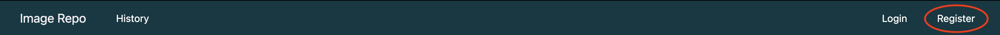
    <li>Create an account by entering all the information in the registration form.</li>
    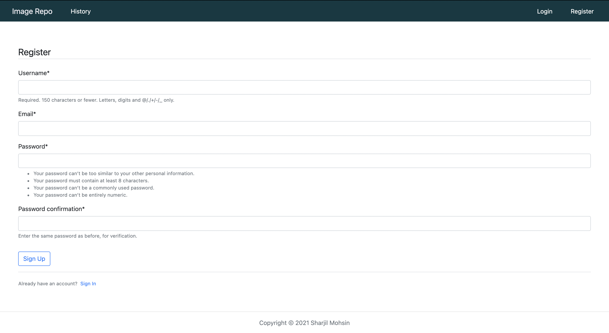
    <li>Login to the account you just created (will be automatically redirected however can also use 'Login' link in top toolbar if that doesn't work.)</li>
    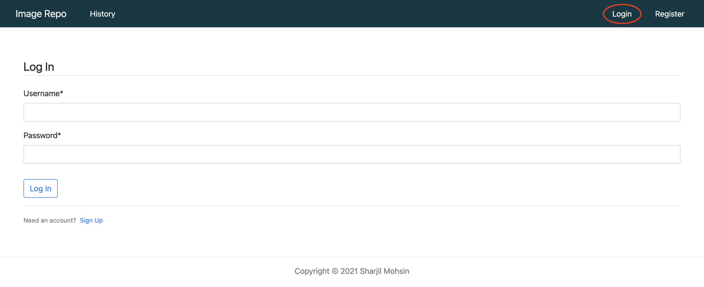
    <li>In the top half of the home page there will be a form to submit an image. Choose a title, add an image and add tags (tags are optional to help search for uploaded images). Click Submit.</li>
    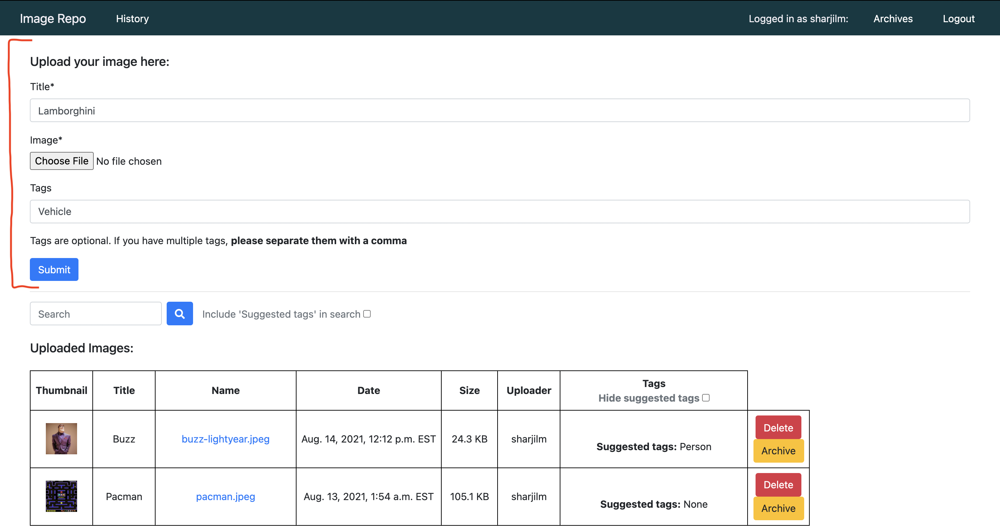
    <li>The image will appear in the table in the bottom half of the home page. From here you can either delete or archive it. You will not be able to perform these for images you did not upload.</li>
    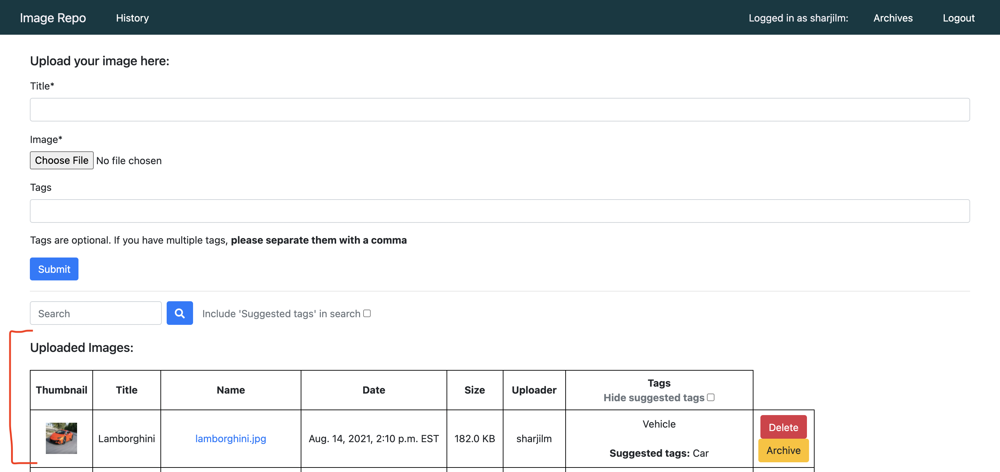
    <li>To download the image, open the image by clicking it's link in the 'Name' column. It will open in a new tab, right click on it and 'Save Image As'.</li>
    <li>You can search for images in the search bar above the table using the image's title, name, or tags (suggested tags are tags generated by object detection - to include them in your search, check the checkbox beside the search field.)</li>
    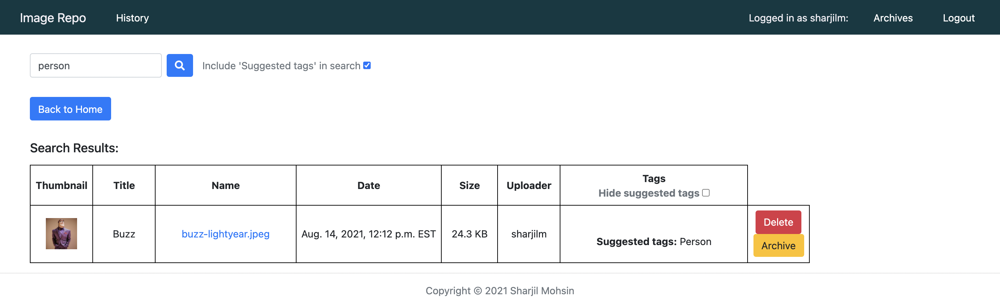
    <li>After deleting an image it will no longer be available. After archiving an image it will be available in your 'Archive' section (can be accessed through the top toolbar). You can repost them from your archive if you wish.</li>
    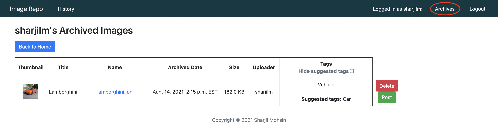
    <li>The 'History' section in the top left provides a log of what images have been uploaded/deleted and by who.</li>
    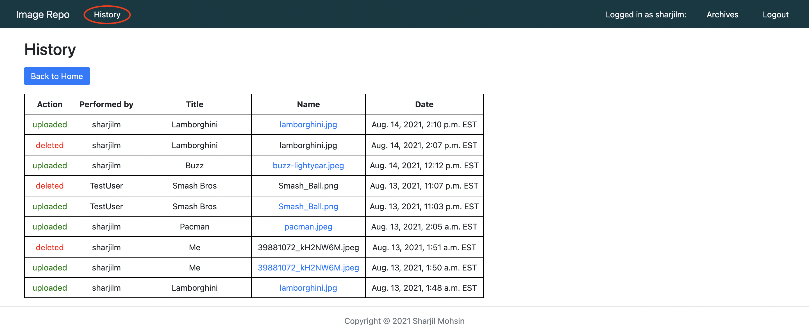
    </ol>

<h2>3) Instructions for running the program from the repo</h2>

Application requires Python (v3.7.3 or a higher 64-bit version). The program can be run either using the bash script or manually.

<u>1) Starting using the bash script:</u>
    <ol>
    <li>Download/clone repo (can download as ZIP).</li>
    <li>In your terminal enter the main directory of the folder “Image-Repository”.</li>
    <li>Run 'chmod u+x start.sh'.</li>
    <li>Run './start.sh' or 'bash start.sh' for Windows.</li>
    <li>In your browser go to http://127.0.0.1:8000.</li>
    </ol>
<u>2) Manual start:</u>
    <ol>
    <li>Download/clone repo (can download as ZIP).</li>
    <li>In your terminal enter the main directory of the folder “Image-Repository”.</li>
    <li>Run 'pip3 install -r requirements.txt —user'.</li>
    <li>Run 'python3 image_repo/manage.py makemigrations'.</li>
    <li>Run 'python3 image_repo/manage.py migrate'.</li>
    <li>Run 'python3 image_repo/manage.py runserver'.</li>
    <li>In your browser go to http://127.0.0.1:8000.</li>
    </ol>

<h2>4) AWS S3 and Google Vision API</h2>

Due to security concerns, the AWS S3 (for image storage) and the Google Vision API (for image object detection) credentials could not be provided in the repo. As a default, the application uses local file storage for storing the images and uses the Python library 'cvlib' for object detection.

An .env.template for what credentials need to provided for these services is provide. The settings.py file (the file that sets the settings for Django) will be reading these credentials from a .env file in the home ('Image-Repository') directory.

The fields underlined in red in the image below would have to be put in to a new .env file in the home directory.

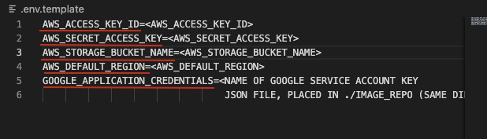

The fields that begin with 'AWS' handle AWS S3 access and the field that starts with 'GOOGLE' is the name of the service account key json file for the Google Vision API (this file should be placed in 'Image-Repository/image_repo/ (the same directory as manage.py). For instructions on how to get the Google Vision API Service Account JSON key <a href="https://daminion.net/docs/topics/auto-tagging/how-to-get-google-cloud-vision-api-key/">follow these instructions.</a>

For instructions on how to get the AWS credentials <a href="https://testdriven.io/blog/storing-django-static-and-media-files-on-amazon-s3/">follow these instructions.</a> However, make the Bucket public and change the Bucket Policy to: 

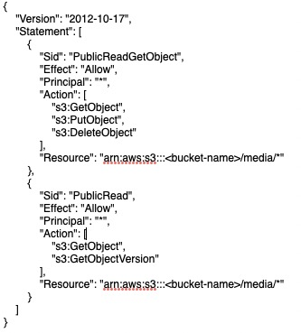

The CORS Config to:

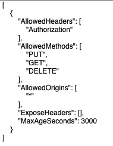

And the User Policy to:

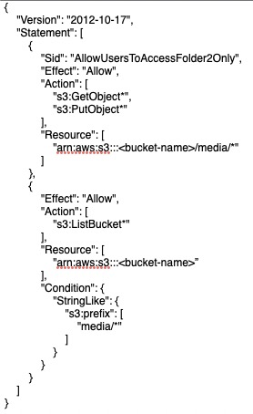

These policy changes limit the users access to the bucket.

Once the credentials are provided and added in the .env file, they can be called into the settings file by uncommenting these lines in the settings.py file.

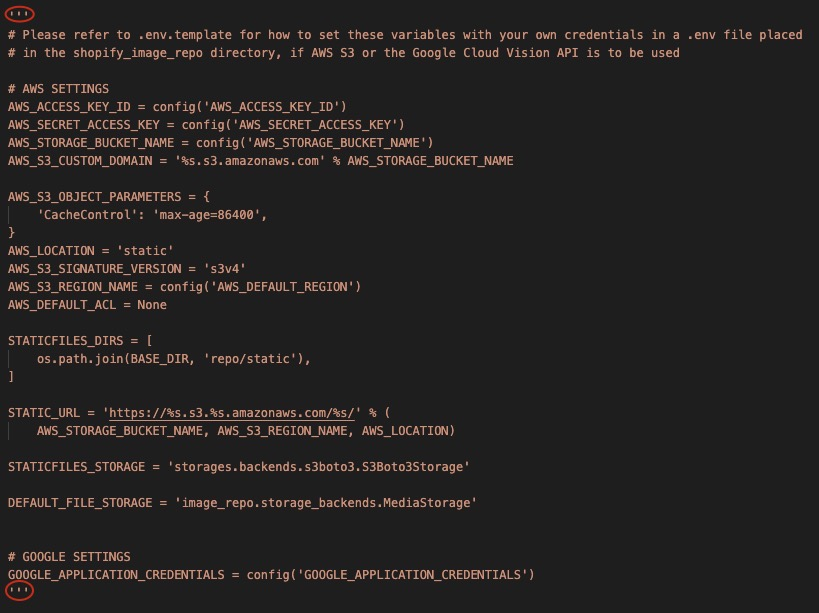

<h2>5) Next Steps</h2>

- Adding a feature that allows the user to reset their password in case they forget it, as well as reset both their username and password if they wish. This can be done by setting a reset link to the email they used when they signed up.
- Implementing automated testing in order to increase the effectiveness, efficiency and coverage of the software testing on this application.
- Creating a video demo of how to use this application, for users who prefer to watch a visual demonstration rather than reading the instructions on README.
- Changing this application from an ordinary image repository to an image repository with a capacity to sell products. This new feature would involve users of different kinds (they can be either vendors or customers). Vendors would be able to create a new image to sell and set their price, handle money, manage inventory, and set discounts on their products, while customers would be able to buy these images using their bank account linked to their accounts.
